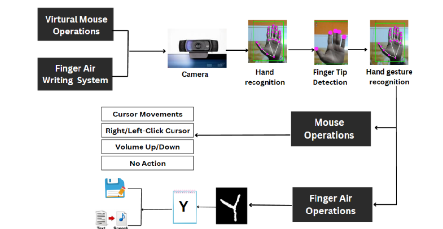

->How to run the project:

-Start by forking the repository to your GitHub account.

-Clone the forked repository to your local machine using the following command in the terminal:

-git clone https://github.com/Anushreebasics/Anuva_CV-DL_project.git

-Open the project in Visual Studio Code (VS Code) or any preferred code editor.

-Adjust the path variables in the code to match the location of the project on your machine.

-Run the GUI.py file to launch the application.

-Now you can utilize the virtual mouse and virtual air writing functionalities. For information on how to perform various operations using gestures, please refer to the instructions below.

# Gesture-Controlled Virtual Mouse and Finger Air Writing

1. Virtual Hand Mouse
- Raise only the index finger to bring the mouse in moving state

- Raise all the fingers except the thumb to lower the volume

- Raise index finger, middle finger and ring finger to increase the volume

- Pinch with thumb and index finger for right click

- Pinch with index finger and middle finger for left click

2. Finger Air Writing
-Upon execution, the application will open a canvas along with an image window in the background.

-The "Clear" function allows you to erase all the text or drawings on the canvas, providing a clean slate.

-With the "Back" function, you can remove the most recently added text, digit, space, or special character from the canvas, acting like a backspace.

-Pressing the "Space" button will insert a space character on the canvas, useful for adding gaps between words or elements.

-By clicking the "Predict" button, the application will attempt to predict the character that you have drawn on the canvas.

-The "Save" function enables you to save the content on the canvas, preserving your work for future reference or sharing.

-You can use the "Color" button to change the pen's color, allowing you to draw or write in different hues.

-You can switch to mouse using "Mouse" button.
